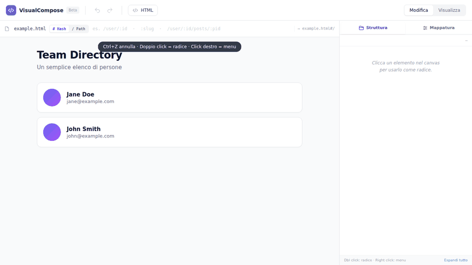
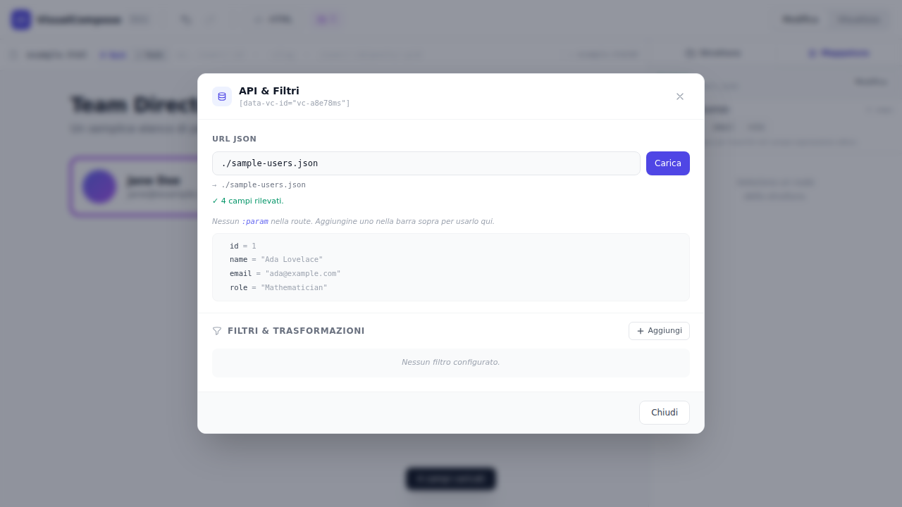
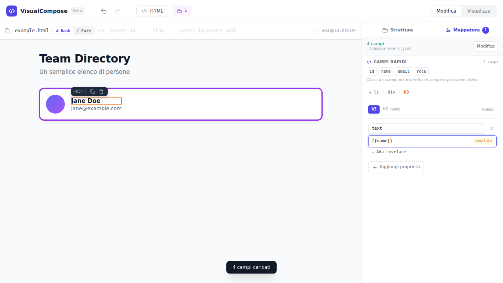
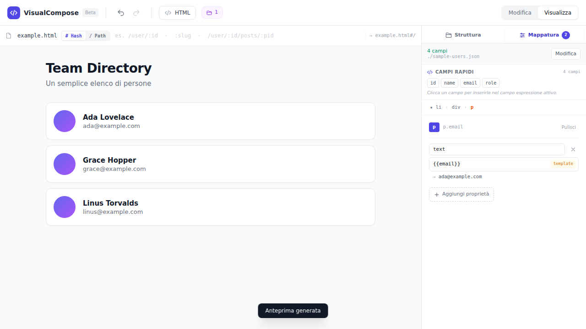

# VisualCompose

> **HTML-first micro-framework** + **visual editor**. Router · template stamping · fluent API client · declarative data binding.
> Zero dependencies · ~5 KB gzipped · no build step · no `eval` (CSP-friendly) · ESM + types.

[](https://github.com/enrickaliberti/visualcompose/actions)
[](https://www.npmjs.com/package/visualcompose)
[](LICENSE)

**[▶ Try the visual editor](https://enrickaliberti.github.io/visualcompose/editor/)** · [Framework demo](https://enrickaliberti.github.io/visualcompose/examples/basic/) · [Architecture](docs/ARCHITECTURE.md) · [Roadmap](docs/ROADMAP.md) · [Italiano](README.it.md)



## Why

Your page is already HTML. VisualCompose keeps it that way: the **markup is the template**, JavaScript only says *where the data comes from* and *which field goes where*. Use it on classic multi-page sites (MPA) or as a small SPA, with the same API.

```html
<ul id="users">
  <li class="user"><a class="link"><b class="name"></b></a></li>   <!-- the visible "mould" -->
</ul>

<script type="module">
  import { VisualCompose } from 'https://cdn.jsdelivr.net/npm/visualcompose@0.1.0/dist/visualcompose.min.js';

  const app = VisualCompose.create({ baseURL: 'https://api.example.com' });

  app.route('/', {
    onEnter: () => app.bind('.user', 'users', {
      '.name': 'name',
      '.link': { href: (u) => `/users/${u.id}` }
    }, { loading: 'Loading…', empty: '<p>No users</p>' })
  }).route('*', { onEnter: () => console.log('404') });

  app.start();
</script>
```

## Install

```bash
npm i visualcompose
```
or via CDN (`<script type="module">` as above; for classic scripts use `dist/visualcompose.iife.min.js`, global `VC`).

## Visual Editor

Don't want to write the mapping by hand? The **[VisualCompose Editor](https://enrickaliberti.github.io/visualcompose/editor/)** lets you build it by pointing and clicking. It runs entirely in your browser (static page, no server, no account) and previews the result with the real framework.

> **Status: beta.** You can design and preview a binding today; exporting the generated code is on the [roadmap](docs/ROADMAP.md). Until then, the editor shows you exactly what to write (see [Under the hood](#under-the-hood)).

### 5-minute tour

**1. Prepare the page.** Click **HTML** and paste your markup (or edit the example). Keep **one** item that will be repeated — that item is the *mould*. The framework clones it once per record.

**2. Pick the root.** *Double-click* the repeated element (here, one `<li class="member">`). It gets a purple outline: it is the **root** the data will be stamped into. Common mistake: choosing the whole `<ul>` repeats the entire list instead of its items.

**3. Load your data.** Open the **Mappatura** (Mapping) tab → **Imposta API** → paste a JSON URL (or `./sample-users.json` to try) → **Carica**. The editor detects the fields and shows them as quick chips. Relative paths and CORS-enabled URLs work; routes like `/api/users/:id` are supported.



**4. Map fields to nodes.** Click a node in the canvas (e.g. the name), then type an expression or click a field chip:

| Expression | Meaning |
|---|---|
| `name`, `user.name` | field / dotted path |
| `{{name}} — {{role}}` | text template |
| `params.id` | route parameter (for `:id` routes) |
| `$index` | position of the item |
| `item.price * 2` | any JavaScript expression using `item`, `index`, `params` |

Each node can bind several properties (`text`, `href`, `src`, `class`, `value`, `data-*`, any attribute). Optional **filters** (`where`, `sort`, `limit`, `unique`, `map`) shape the data before rendering.



**5. Preview.** Press **Visualizza** (or `Ctrl+Enter`). The page is rendered with the real VisualCompose `bind()` — one card per record.



### Shortcuts

| Key | Action |
|---|---|
| Double-click | set root |
| Right-click | context menu (duplicate, wrap, move, copy selector…) |
| `Del` | delete selected element |
| `↑` / `↓` | select previous / next element |
| `Alt+↑` / `Alt+↓` | move element |
| `Ctrl+D` | duplicate |
| `Ctrl+Z` / `Ctrl+Shift+Z` | undo / redo |
| `Ctrl+Enter` | toggle Edit ↔ Preview |
| `Esc` | deselect |

Your work is auto-saved as a draft in this browser's `localStorage` every 30 s.

### Under the hood

The mapping from the tour is exactly this call:

```js
app.bind('.member', './sample-users.json', {
  '.name':  'name',
  '.email': 'email'
});
```

### Run it locally

```bash
git clone https://github.com/enrickaliberti/visualcompose && cd visualcompose
npm install && npm run serve        # then open http://localhost:8080/editor/
```
The editor loads the framework from this repo (`src/visualcompose.js`) and falls back to jsDelivr.

### Good to know
- **Expressions are JavaScript** executed in your browser. Only open pages and expressions you trust.
- Absolute API paths such as `/api/users` resolve against `github.io`; use a full URL (with CORS) or a relative JSON file.
- Tailwind is loaded from its development CDN for now.

## The four pieces (each does one thing)

| Module | Responsibility |
|---|---|
| **Router** | Match URL → extract `:params` and `?query` → `onEnter` / `onLeave`. Never renders. History or `#hash` routes. `*` = 404. |
| **TemplateRegistry** | Turn *any* source (selector, `<template>`, HTML string, file URL, fragment) into `{ content, scripts }`, cached pristine. |
| **ApiClient** | `app.table('users/:id').params({id}).query({q}).where().sort().limit().get()` — fluent `fetch`, GET cache, automatic invalidation on writes. |
| **BindingEngine** | `bind(target, data, mapping, options)`: clone a mould per item, map fields to nodes, handle loading/empty/error. |

### `bind()` – two modes
- **No `template` option** → `target` is a visible mould in the DOM: cloned N times, the original is removed, re-binds replace the clones.
- **With `template`** → `target` is the container, `template` is the mould; container is refilled (`mode: 'replace' | 'append'`).

### Mapping
```js
{ '.name': 'user.name',                     // dotted path → text
  '.avatar': 'avatarUrl',                    //  → src, <a> → href, <input> → value
  '.row': { class: (d) => d.active ? 'on' : 'off', 'data-id': 'id', onclick: (d) => open(d) },
  '.pos': '$index',  '.who': 'params.id' }   // special sources
```
Prefer `text` over `html`: `html`/`innerHTML` insert raw markup (see [SECURITY.md](SECURITY.md)).

## Compared to…

| | VisualCompose | htmx | Alpine.js | Vue / React |
|---|---|---|---|---|
| Build step | none | none | none | usually |
| Size (min+gz) | ~5 KB | ~14 KB | ~16 KB | 30–45 KB+ |
| Template language | plain HTML | plain HTML + attrs | HTML + directives | SFC / JSX |
| Client router | ✔ built in | ✘ (server) | ✘ | add-on |
| JSON API client | ✔ fluent + cache | ✘ (HTML over the wire) | ✘ | add-on |
| Visual editor | ✔ | ✘ | ✘ | third-party |
| Reactivity / state | ✘ (explicit `bind`) | ✘ | ✔ | ✔ |

Pick VisualCompose when you have **JSON endpoints + server-rendered or static HTML** and want routing and rendering without adopting a component model.

## Develop
```bash
npm install
npm test            # vitest + jsdom
npm run typecheck   # JSDoc types checked by tsc
npm run build       # dist/: esm, esm.min, iife.min, types
npm run serve       # then open /editor/ or /examples/basic/
```
See [CONTRIBUTING.md](CONTRIBUTING.md). License: [MIT](LICENSE).
